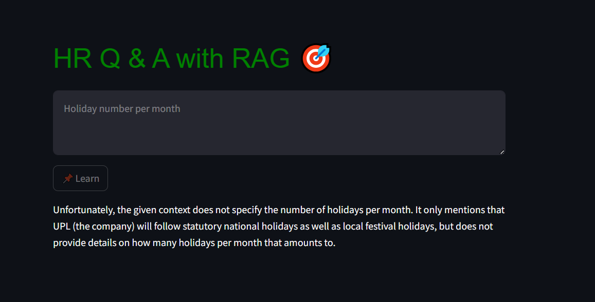

# HR RAG

This project builds a Retrieval Augmented Generation model using HR policy documents.

## Run

After having installed the environment.yml and configured your credentials (see PREREQUISITES.md)

    streamlit run rag_frontend.py